# Israeli Google Drive Accounting Doc Router

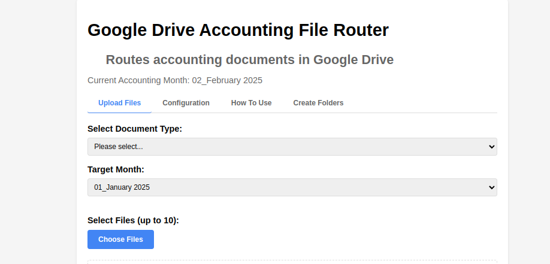

## Functionality

This Google Apps Script utility provides a template for Routing common accounting documents, namely invoices, receipts and expenses, into designated Google Drive folders. 

The user can either specify existing folders or have the app generate them. The folders follow a deterministic structure with the year name and the month in a specified format common to each subfolder. 

The user uploads up to 10 documents at a time. Currently, for each upload queue, only one type of document is supported (ie, you can't route one queue into different places). 

The user has the ability to rename the files to make them more descriptive. And by ticking the Israeli checkbox the document(s) are routed into an Israeli subfolder. This is intended to ease administration for freelancers and others who have a mixture of Israeli and non Israeli clients for VAT purposes etc. 

The confirmation message displays a file path and the file should be routed according to the logic integrated into the app.

## How To Use

- In Google Drive, create a new Google Apps script
- Alternatively, visit scripts.google.com  

Add the two files to the project:

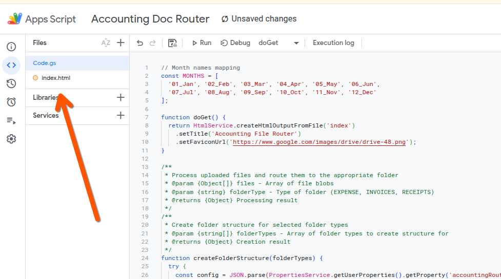

Then, save the scripts. The first time that you run the script, you will need to give it permission to read and write to your Google Drive. 

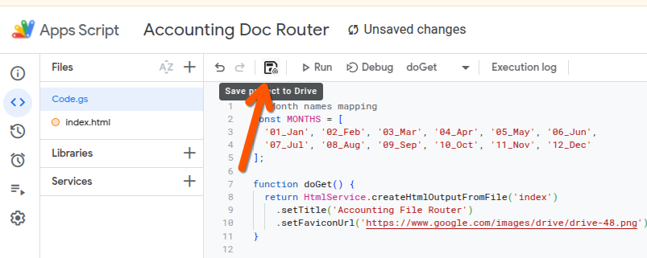

Set up the deployment as a web app (option 3):

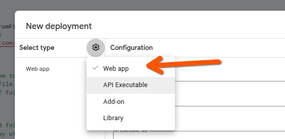

Set the access permission as either only you or anyone in your Google Workspace:

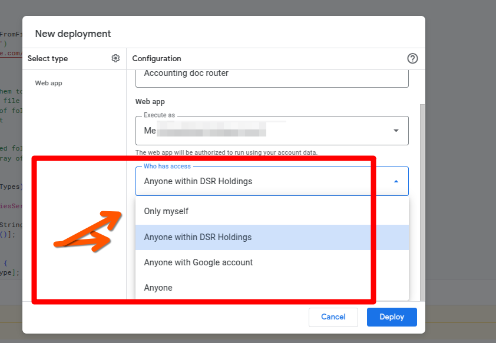

Hit deploy to upload your app:

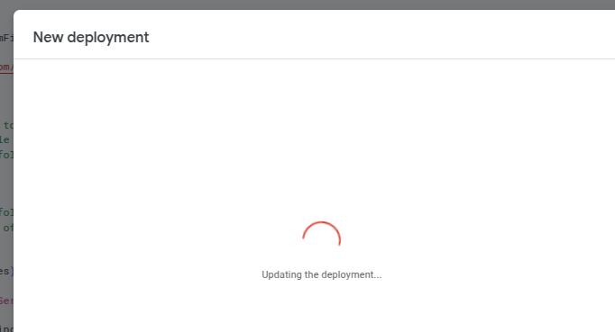

You'll get a confirmation message showing the public URL:

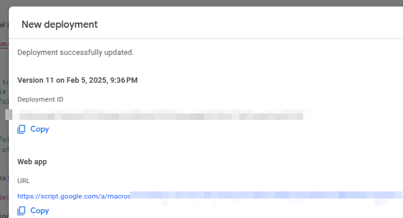

## Folder Structure

You can use the Folder Structure Creation utility in order to build the folders for the first time. 
 
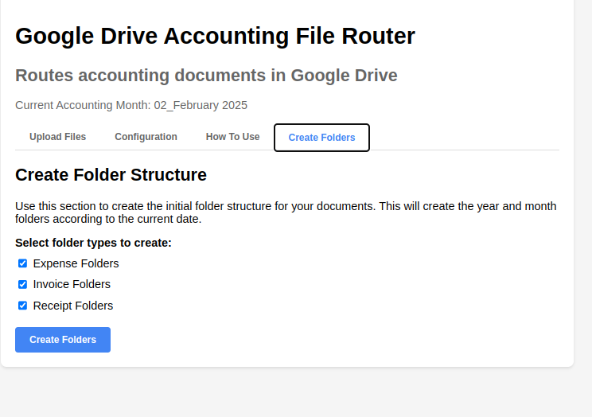

Or you can populate folders with the following structure:

### Expected Folder Structure For Accounting Folders

📁 Root  
├── 📁 2024  
│   ├── 📁 01_Jan  
│   ├── 📁 02_Feb  
│   └── 📁 03_Mar  
│ 
└── 📁 2025  
    ├── 📁 01_Jan  
    ├── 📁 02_Feb  
    └── 📁 03_Mar

 ## Screenshots & Functionality (V1)

 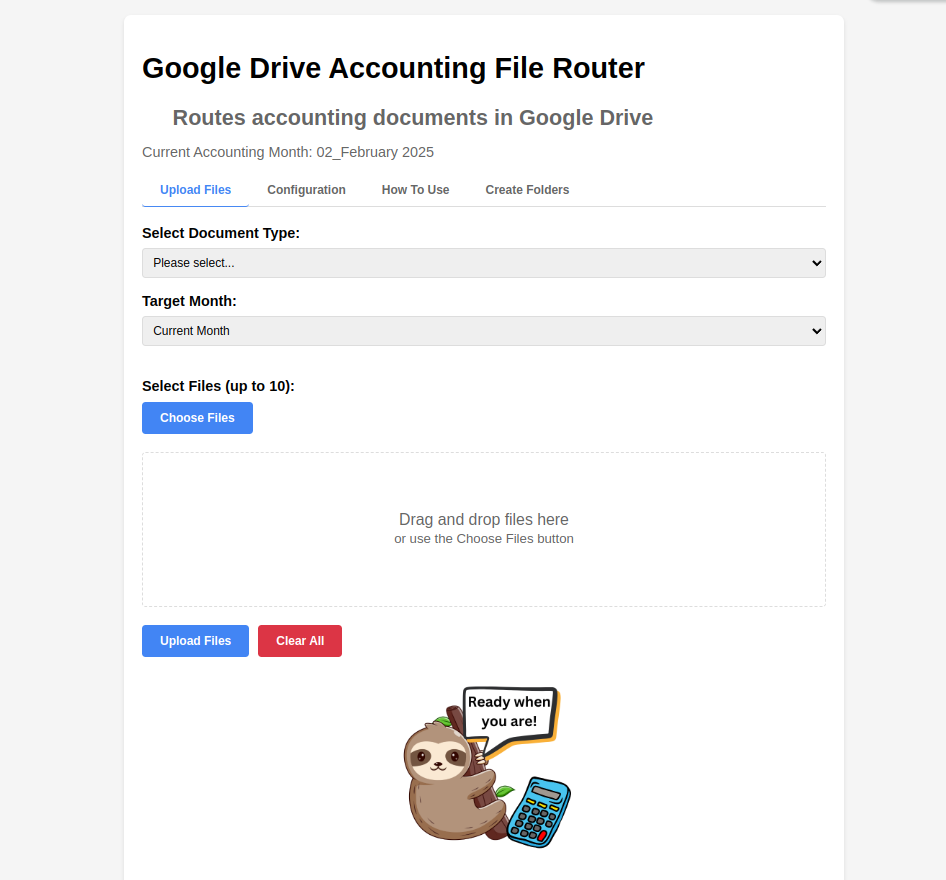

 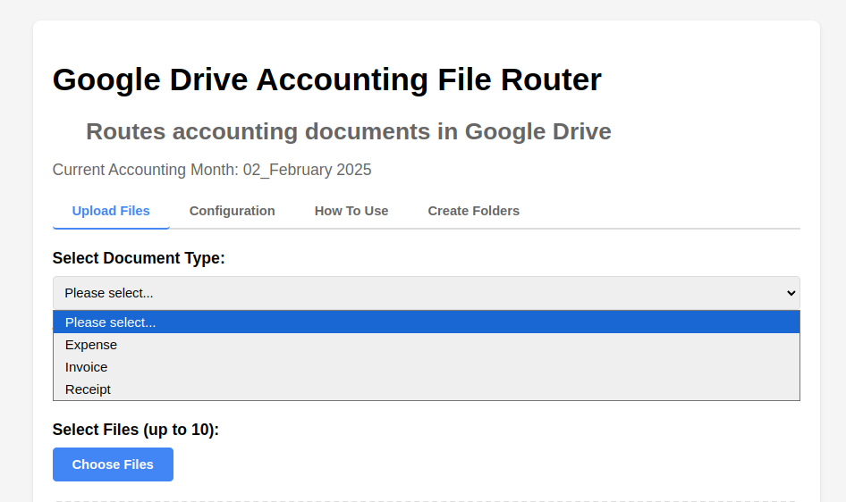

 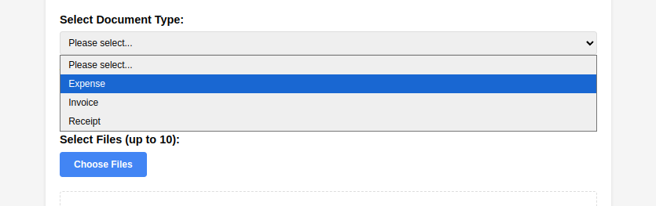

 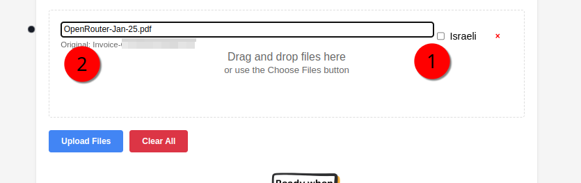

 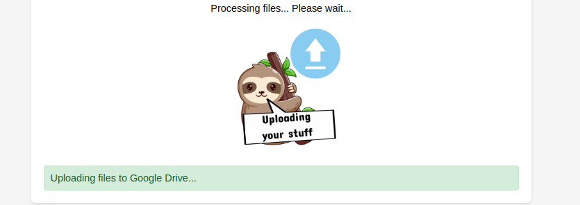

 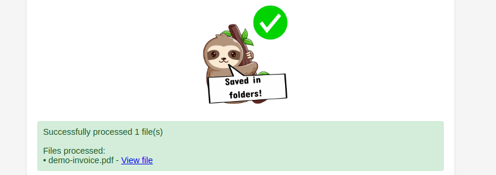

 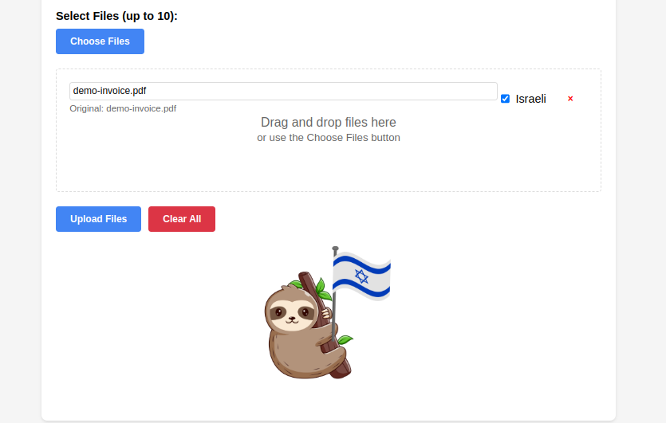

 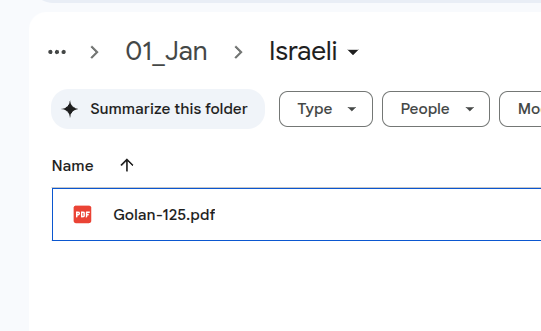

## Use Case Statement

## Author

Daniel Rosehill  
(public at danielrosehill dot com)

## Licensing

This repository is licensed under CC-BY-4.0 (Attribution 4.0 International) 
[License](https://creativecommons.org/licenses/by/4.0/)

### Summary of the License
The Creative Commons Attribution 4.0 International (CC BY 4.0) license allows others to:
- **Share**: Copy and redistribute the material in any medium or format.
- **Adapt**: Remix, transform, and build upon the material for any purpose, even commercially.

The licensor cannot revoke these freedoms as long as you follow the license terms.

#### License Terms
- **Attribution**: You must give appropriate credit, provide a link to the license, and indicate if changes were made. You may do so in any reasonable manner, but not in any way that suggests the licensor endorses you or your use.
- **No additional restrictions**: You may not apply legal terms or technological measures that legally restrict others from doing anything the license permits.

For the full legal code, please visit the [Creative Commons website](https://creativecommons.org/licenses/by/4.0/legalcode).