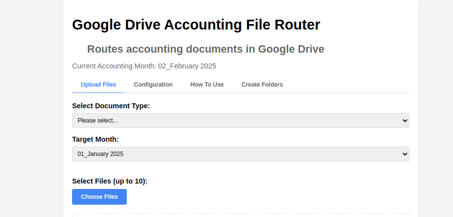
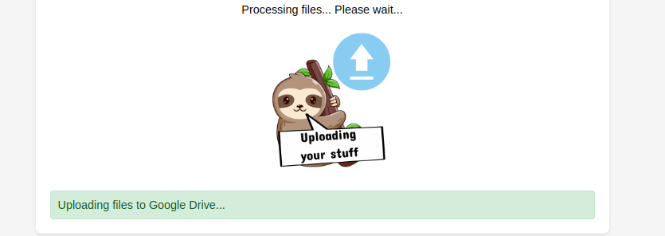
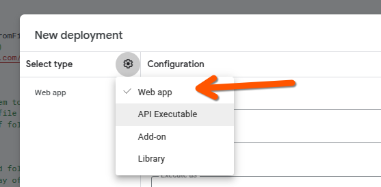

# Streamlining Document Management: Building a Google Drive Router for Accounting Documents

As a freelancer or business owner dealing with both Israeli and international clients, managing accounting documents can quickly become a complex task. That's why I developed a specialized Google Apps Script application that automates the organization of invoices, receipts, and expenses in Google Drive.



## The Challenge

Managing accounting documents across different tax jurisdictions presents unique challenges:
- Separating Israeli and international documents for VAT purposes
- Maintaining a consistent folder structure across years and months
- Efficiently handling multiple document uploads
- Ensuring proper naming conventions for easy retrieval

## The Solution

I created a Google Apps Script application that provides an intuitive web interface for routing accounting documents to their appropriate folders in Google Drive. The application automatically:

- Creates and maintains a structured folder hierarchy by year and month
- Separates Israeli and non-Israeli documents
- Handles batch uploads of up to 10 documents
- Allows custom file renaming for better organization

## Technical Implementation

The application is built using Google Apps Script, which provides seamless integration with Google Drive. It consists of two main components:

1. **Frontend (index.html)**
   - Clean, user-friendly interface
   - File upload functionality
   - Document type selection
   - Israeli/non-Israeli toggle
   - File renaming capabilities

2. **Backend (Code.gs)**
   - Folder structure management
   - File routing logic
   - Google Drive API integration
   - Error handling and validation

## Key Features

### 1. Intelligent Folder Structure
The application maintains a deterministic folder structure:

```
📁 Root
├── 📁 2024
│   ├── 📁 01_Jan
│   ├── 📁 02_Feb
│   └── 📁 03_Mar
└── 📁 2025
    ├── 📁 01_Jan
    ├── 📁 02_Feb
    └── 📁 03_Mar
```

### 2. Batch Upload Processing


Users can upload up to 10 documents simultaneously, streamlining the process of organizing multiple files.

### 3. Smart Document Routing


The application intelligently routes documents based on:
- Document type (invoices, receipts, expenses)
- Israeli/non-Israeli classification
- Current date (for automatic month/year folder selection)

### 4. Custom File Naming


Users can rename files before routing to make them more descriptive and easier to find later.

## Deployment Process

Deploying the application is straightforward:

1. Create a new Google Apps Script project
2. Add the Code.gs and index.html files
3. Configure deployment settings as a web app
4. Set appropriate access permissions
5. Deploy and obtain the public URL



## Benefits

This application offers several key advantages:

1. **Time Savings**: Automates the tedious process of manually organizing documents
2. **Consistency**: Ensures a uniform folder structure across all document types
3. **Compliance**: Separates Israeli and international documents for easier tax reporting
4. **Scalability**: Handles growing document volumes with ease
5. **User-Friendly**: Intuitive interface requires minimal training

## Open Source and Available for All

The project is licensed under CC-BY-4.0, allowing anyone to:
- Use the application for their own document management needs
- Modify and adapt the code for specific requirements
- Share and distribute the solution with others

## Looking Forward

This tool demonstrates how Google Apps Script can be leveraged to create practical solutions for real-world business challenges. By automating document management, it frees up valuable time that can be better spent on core business activities.

The source code is available on GitHub, and I welcome contributions from the community to enhance its functionality further.

---

*This project was created by Daniel Rosehill (public at danielrosehill dot com) and is licensed under CC-BY-4.0.*
